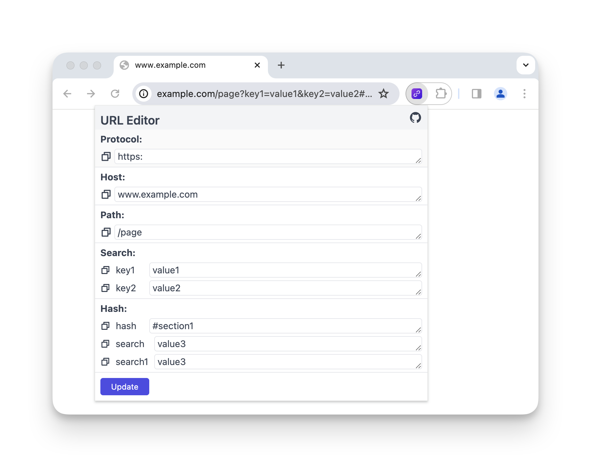

<h1 align="center">URL Editor<h1/>

🔗 A browser extension to parse and edit urls.

## Features

- 🔗 parse url
- 🤳 copy url param

## TODO

- [ ] edit url
- [ ] theme 

## Thanks

- [vue](https://github.com/vuejs/vue)
